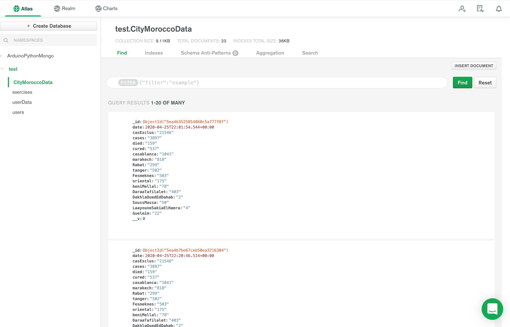
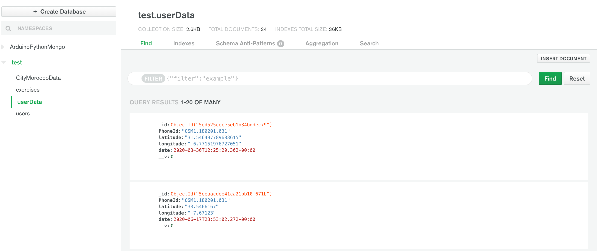
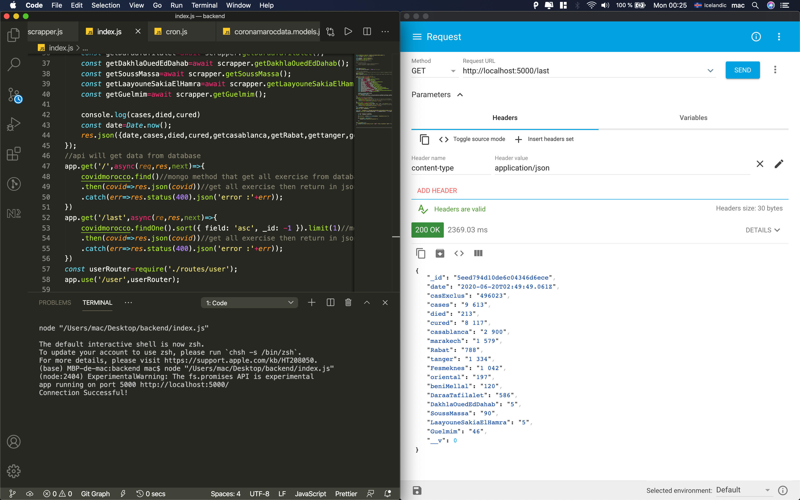
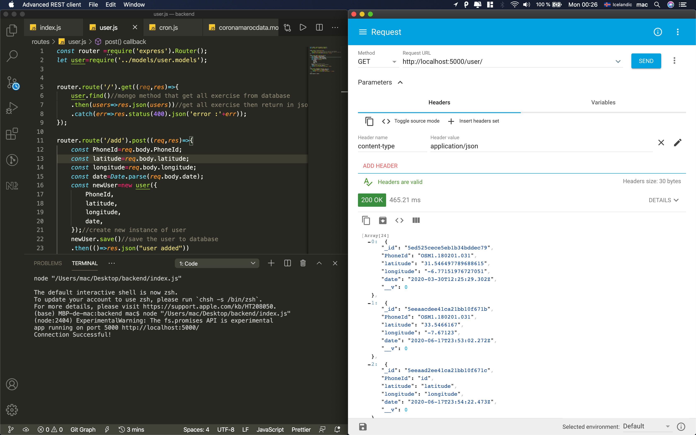

# coronaMorocco_api_backend_nodejs

scrapping corona update  data  from the website then inserting it to database also providing api to get the data

when we run the server every hour a scrapper will scrapp data from website using th e-method of <b>cronjob</b> then send it to mongodb database 
and server provid api to get the data from the database

also provide api to get all data of users and there localisation and users are added automatically <a href='https://github.com/kensamaa/covid_getData_app'>using the flutter application </a>(click to go to the repo)  

<h2>screenshots</h2>
 
<h4>covid19 data in mongodb</h4>

<h4>user data in mongodb</h4>

<h4>api that send the last data in the collection of covid19 in db</h4>

<h4>api that sends data of all users</h4>

<h2>commande line used</h2>
<ul>
<li>npm init -y </li>
<li>npm install mongoose dotenv</li>
<li>nodemon server</li>
<li>npm i bootstrap</li>
<li>npm i react-router-document</li>
  <li>npm i puppeteer</li>
  <li>npm i node-cron</li>
  <li>npm i cheerio</li>
</ul>

<h2>websites</h2>

<ul>
<li>https://www.worldometers.info/coronavirus/</li>
<li>https://www.tutorialkart.com/nodejs/mongoose/insert-document-to-mongodb/</li>
<li>http://www.covidmaroc.ma/Pages/AccueilAR.aspx</li>
  <li>https://pptr.dev/#?product=Puppeteer&version=v4.0.1&show=api-class-puppeteer</li>
</ul>
